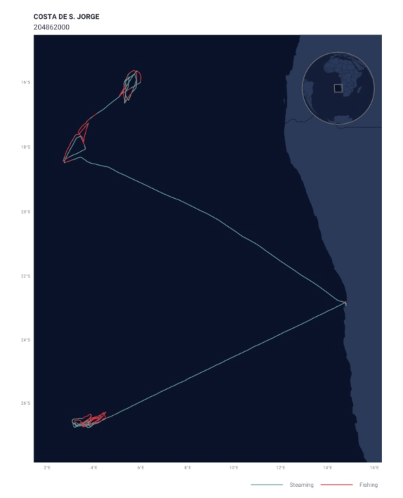

# Assessing Trends in Fishing Effort Inside and Outside Peru's EEZ Using AIS Data from Global Fishing Watch.

### Authors

Javier Patrón jpatron\@ucsb.edu

Jessica French jfrench\@bren.ucsb.edu

Pol Carbó Mestre pcarbomestre\@ucsb.edu

``` python
## Table of Contents
1. Purpose(#purpose)
2. Dataset Description(#overview)
3. Data I/O(#io)
4. Metadata Display and Basic Visualization(#display)
5. Use Case Examples(#usecases)
6. Create Binder Environment(#binder)
[7. References](#references)
```

## Notebook Purpose

The purpose of this notebook is to explore Global Fishing Watch's dataset showing daily fishing effort as inferred fishing hours daily. This notebook will show how to read in the dataset, visualize the data using google earth engine, and give an overview of how the data can be used to explore differences in fishing effort within and outside Peru's EEZ and how fishing effort is impacted by El Niño Southern Oscillation (ENSO) events.

## Dataset Description

The Global Fishing Watch (GFW) provides an open platform to access Automatic Identification System (AIS) data from commercial fishing activities. The AIS is a tracking system that uses transceivers on ships to broadcast vessel information such as unique identification, position, course, and speed. AIS is integrated into all classes of vessels as a collision avoidance tool. However, the GFW collects and processes raw AIS data related to fishing activities to improve records and assign additional information, such as the distance from shore, depth, etc. Then, with the use of machine learning models, they characterize vessels and fishing activities, which constitute some of the products available in their API.

One of the most interesting products that the GFW API offers is estimates of fishing effort derived from AIS data. GFW uses machine learning models to classify fishing vessels and predict when they are fishing. First, they identify fishing vessels in the AIS system. Then the vessel is characterized using the best available information and their fleet registry data combined with a characterization model trained on 45,441 marine vessels (both fishing and non-fishing) matched to official fleet registries. Then, GFW estimates the vessel's fishing time and location based on its movement patterns. To do so, a fishing detection model was trained on AIS data from 503 ships and identified fishing activity with \>90% accuracy. The model predicts a score for every AIS position in their database to distinguish fishing positions from non-fishing positions (i.e., navigation time). When the model identifies fishing activity, the time associated with that AIS position is registered as apparent fishing activity. More details about the model can be found on the following GitHub repository ([link)](https://github.com/GlobalFishingWatch/vessel-scoring/blob/master/notebooks/Model-Descriptions.ipynb).

{fig-align="center" width="40%"}

{fig-align="center" width="40%"}

Once the fishing vessels are identified and their AIS positions have been assigned as fishing positions, the apparent fishing effort can be calculated for any area by summarizing the fishing hours for all fishing vessels in that area. The resulting maps of apparent fishing effort are created by rasterizing all AIS positions into a grid and calculating the total fishing activity in each grid cell. For the present project we will access this type processed data.

{fig-align="center" width="80%"}

Pre-processed AIS data can be accessed from their [R package "gfwr"](https://github.com/GlobalFishingWatch/gfwr) or downloaded from their [website](https://globalfishingwatch.org/data-download/) as .cvs files. For this project, we will use some of their existing products related to fishing effort. The data can be accessed from [Google Big Query](https://globalfishingwatch.org/data/our-data-in-bigquery/) in a less processed format and through Google Earth Engine (GEE) for two data subproducts [daily fishing hours](https://developers.google.com/earth-engine/datasets/catalog/GFW_GFF_V1_fishing_hours) and [daily vessel hours](https://developers.google.com/earth-engine/datasets/catalog/GFW_GFF_V1_vessel_hours#image-properties). For accessibility reasons, we will focus on the GEE data related to fishing hours.

Each image in the collection contains daily rasters of fishing effort measured in hours of inferred fishing activity per square kilometer. Data is available for a given flag state and day, over a 5 years period (2012-2017), where each band represent a fishing gear type. The following figure summarizes the image resolution and the available bands.

The data used belongs to the [first global assessment of commercial fishing activity](https://www.science.org/doi/full/10.1126/science.aao5646), published in Science by GFW (2018).

## Dataset Input/Output

Load in necessary packages.

``` python
# Import packages
import ee
import geemap
import pandas as pd
import matplotlib.pyplot as plt
import numpy as np
import json
from itertools import chain
import os
```

Authenticate and initialize google earth engine.

``` python
# Authenticate google earth engine
#ee.Authenticate()
# Initialize google earth engine 
ee.Initialize()
Read in the data from google earth engine and filter metadata to include all countries.
```

# Read in the data on fishing hours from google earth engine

``` python
dataset = ee.ImageCollection('GFW/GFF/V1/fishing_hours')
# Filter by "WLD" to get all global fishing vessel hours. This includes all countries in the dataset. 
fishing_effort_ImgCollection = dataset.filterMetadata('country', 'equals', 'WLD')
# SRTM data to use for background in the gif.
SRTM=ee.Image("USGS/GTOPO30")
```

We define two areas of interest (AOI) for the time series analysis. The first one relative to the EEZ of Peru stored data/eez_peru/geojson/eez_peru.geojson. The second AOI is a square area comprizing the EEZ and the neigboring waters in the west. We chose to focus on the area of Peru's coast that includes two of the largest fishing ports, Paita and Callao.

``` python
# Read in EEZ geometry of Peru 
with open('data/eez_peru/geojson/eez_peru.geojson') as f:
  geojson = json.load(f)
coords = geojson["features"][0]["geometry"]["coordinates"]
## The resulting List from the geojson file has an extra bracket that we have to remove to be read it as a polygon
aoi_1 = ee.Geometry.Polygon([i for i in chain.from_iterable(coords)])
```

``` python
# Defining new AOI including areas beyond the EEZ
geojson = {
  "type": "FeatureCollection",
  "features": [
    {
      "type": "Feature",
      "properties": {},
      "geometry": {
        "coordinates": [
          [
            [
              -89.8703470212856,
              -2.9010789371311176
            ],
            [
              -89.8703470212856,
              -19.936548732128458
            ],
            [
              -70.081492068508,
              -19.936548732128458
            ],
            [
              -70.081492068508,
              -2.9010789371311176
            ],
            [
              -89.8703470212856,
              -2.9010789371311176
            ]
          ]
        ],
        "type": "Polygon"
      }
    }
  ]
}
coords = geojson["features"][0]["geometry"]["coordinates"]
aoi_2 = ee.Geometry.Polygon(coords)
```

Define visualization parameters.

``` python
# Define color palette for visualizations
trawlersVis = {
  'palette': ['0C276C', '3B9088', 'EEFF00', 'ffffff']
}

# Define video parameters
videoArgs = {
    'dimensions': 670,
    'region': aoi_2,
    'framesPerSecond': 4,
    'crs': 'EPSG:4326',
    'min': 0.0,
    'max': 3.0,
    'palette': ['0C276C', '3B9088', 'EEFF00', 'ffffff']
}
```

## Metadata Display

We can look at the metadata and bands in a couple different ways. The code below is a little overwhelming and diffficult to search through.

``` python
# Extract the first image so we can look at info about the data in general. 
image_test = dataset.first()
info = image_test.getInfo()
print(info)
```

This code allows you to see only the band names and numbers in a more readable format.

``` python
def get_image_ids(gee_snipet):
  x = ee.ImageCollection(gee_snipet)
  first_image = x.first()
  bands_list = first_image.bandNames()
  lista = bands_list.getInfo()
  for i, val in enumerate(lista):
    print(i,val)
    
#Example
print(get_image_ids('GFW/GFF/V1/fishing_hours'))
```

To read on the metadata we will first create an object image from the collection and index their properties. To built this first image we will create and use simple methods over the original dataset of GEE.

``` python
# Creating an image with some filters on time and space
fishing_image = dataset \
    .filterBounds(aoi_2) \
    .first()

# See image properties with their names and values
fishing_props = geemap.image_props(fishing_image)
fishing_props.getInfo()

# Index by country
country = fishing_props.get('country')
print('Country:', country.getInfo())

#Represent the image properties with propertyNames()
properties = fishing_image.propertyNames()
print('Metadata properties:' , properties.getInfo())
```

## Metadata CSV Description:

The GFW [website](https://globalfishingwatch.org/data-download/datasets/public-fishing-effort) allows us to access individual datasets of AIS-based fishing effort and vessel presence. These datasets are provided in daily `.csv` file format and include the same data that is available through the GFW's Google Earth Engine (GEE) API. By examining these files, we can gain insight into the GEE API metadata, such as the number of fishing hours per cell and day, the fishing state flag, and the type of gear used. This information can help us understand how the data is structured on the GEE fishing hours dataset.

``` python

#Reading the CSV file with the attributes of the metadata
raw_fishing_vessels = pd.read_csv('data/2016-01-01.csv')
raw_fishing_vessels.head()
```

From that file, we can group, count, and sort the data to see which countries and gear types are most highly represented for that day.

``` python
# Check for even representation of vessels
print(raw_fishing_vessels['flag'].value_counts().sort_values(ascending=False).head())
print(raw_fishing_vessels['geartype'].value_counts().sort_values(ascending=False).head())
```
